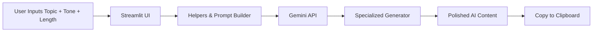

# 🚀 AI Content Engine

**AI-powered blog, tweet, caption & LinkedIn generator**  
*Built with Streamlit + Google Gemini*


---

## ✨ Turn ideas into scroll-stopping content in seconds

A sleek, interactive web app that lets you generate **professional blogs**, **viral tweets**, **engaging captions**, and **LinkedIn posts** using Google's powerful **Gemini AI** — all in one beautiful **Streamlit interface with a custom background**.

**Perfect for creators, marketers, founders & social media professionals.**

---

# 🚀 Quick Start (30 seconds)

<details>
<summary><strong>1. Clone & Install</strong></summary>

```bash
git clone https://github.com/Sham-S08/AI-Content-Engine.git
cd AI-Content-Engine
pip install -r requirements.txt
```

</details>

---

# ✨ Features

- 📝 **4 Content Types** — Blog • Tweet • Caption • LinkedIn  
- 🎛 **Fully Customizable** — Tone, length, keywords, audience  
- 🤖 **Gemini-Powered** — Smart, creative, human-like output  
- 📋 **One-Click Copy** — Instant clipboard buttons  
- 🎨 **Stunning UI** — Custom background + clean modern design  
- 🔒 **Private & Local** — Your API key never leaves your machine  

---

# 🛠 Tech Stack

| Layer | Technology |
|------|-----------|
| UI | Streamlit |
| AI | Google Gemini (`google-genai`) |
| Config | python-dotenv |
| Core | Python |

---

# 📂 Project Structure

```text
AI-Content-Engine/
│
├── ui/
│   ├── streamlit_app.py     # Main interactive app
│   └── bg.jpg               # Beautiful background
│
├── app/
│   ├── blog_generator.py
│   ├── tweet_generator.py
│   ├── caption_generator.py
│   └── linkedin_generator.py
│
├── utils/
│   ├── config.py            # API & env setup
│   └── helpers.py           # Gemini prompts & helpers
│
├── requirements.txt
├── .env                     # Your secret key
└── LICENSE
```

---

# 🔄 How It Works



---

# 🤝 Contribute

Love it? **Fork it!**

You can:

- Improve prompts in `utils/helpers.py`
- Add new content formats
- Enhance the UI
- Add export options

Pull Requests are welcome ❤️

---

<div align="center">

### ❤️ Made with love by **Shambhavi Srivastava**

⭐ **Star the repo if it sparks joy!**

</div>
